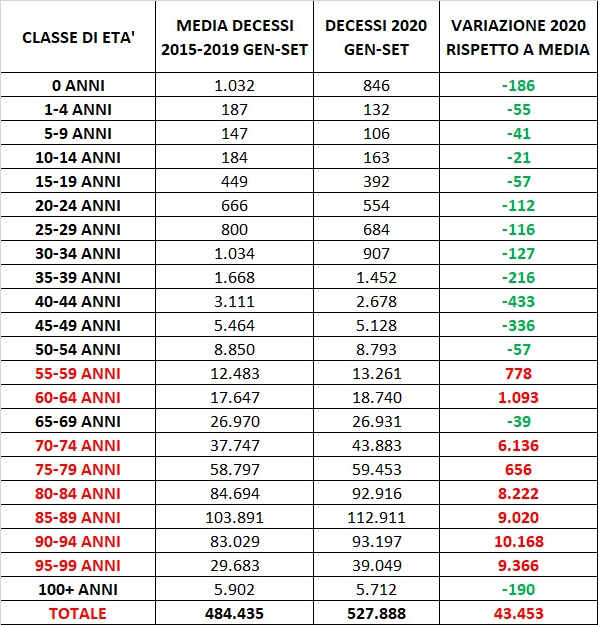
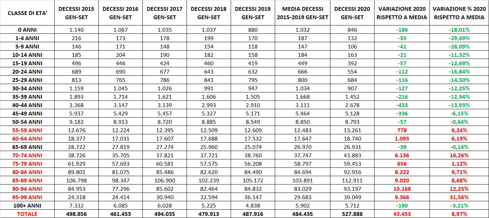

speriamo in qualche giorno di tornare alla "normalità".

Nei giorni scorsi invece un caro amico, Gianmaria, mi ha mostrato dei dati sulla mortalità, da lui raccolti e elaborati a partire da dati Istat, che mostrano l'aumento di mortalità di quest'anno rispetto alla media degli ultimi 5 anni. Stiamo parlando di circa 45 mila persone in più, unicamente nella fascia sopra i 55 anni e in particolare sopra gli 80, mentre la mortalità nelle fascie più giovani della popolazione è (leggermente) diminuita.

Detto in altri termini: quest'anno, tra gennaio e settembre, sono morte in Italia circa quarantacinque mila persone in più rispetto alla media degli scorsi anni. Di queste 45mila, 36mila avevano più di 80 anni. Con una postilla: soprattutto per settembre, i decessi saranno di più di quelli indicati perché ogni volta, spiega l’Istat, il mese più vicino a quello del rilascio ha sempre dati sottostimati.

Gianmaria ha elaborato i dati, dopo averli estratti da 4 file Excel con i decessi suddivisi per classi di età, aggregati a livello nazionale, suddivisi per mese e poi sommati gennaio-settembre.

> Fonte: https://www.istat.it/it/archivio/240401 > Dati decessi 2015-2020

Per i dati estesi ad ogni singolo anno, per valutare anche il trend, clicca qui

Mi sembra che questi dati siano estremamente significativi. Non si va per il sottile nel cercare valutazioni che è difficile fare già caso per caso, del tipo "questa persona è morta per coronavirus o con coronavirus". Non si cerca di attribuire la causa del decesso ad ogni decesso: si prende il dato nel suo complesso, si confronta con quanto è accaduto gli scorsi anni e si guarda se la variazione rientra in una normale variabilità statistica o no. C'è da prendere un minuto e guardarsi bene questa tabella, ricordarsi certo che dietro ogni numero c'è un Giacomo, una Benedetta, un Raffaele, e che ciascuno ne tragga le proprie riflessioni.

Avrei una serie di considerazioni sulla inadeguatezza - a dire il meno - di questo governo nella gestione della pandemia, e forse di quasi tutti i governi almeno occidentali. Ma non voglio soffermarmici, perché l'incapacità di affrontare seriamente e per tempo la pandemia e la cialtronaggine che questo dimostra è così enorme che mi lascia sinceramente incredulo e atterrito.

Piuttosto, pensavo che se io non avessi famiglia, il mio comportamento potrebbe essere molto diverso, molto meno controllato. Vale a dire, se fossi single o se non avessimo figli potremmo decidere se essere molto prudenti - continuare a lavorare da remoto e non vedere nessuno - per poter incontrare regolarmente i nostri genitori senza rischi per loro, oppure se semplicemente vivere normalmente, evitando solo il contatto con anziani o soggetti a rischio e con chi vive con anziani o soggetti a rischio.

Invece, il fatto di avere dei figli che frequentano l'asilo, e quindi sono in contatto con altri bambini e altre persone, che spesso non hanno la possibilità di essere isolati rispetto ai nonni o altre persone a rischio, fa sì che siamo chiamati volenti o nolenti alla responsabilità. Non posso scegliere le persone con cui il mio nucleo familiare verrà in contatto, quindi devo presumere che verrò in contatto con soggetti a rischio, per i quali contrarre il coronavirus costituirebbe un rischio migliaia di volte più grave di quello che corro io.

Poi, bisogna aggiungere anche che il dato dei decessi attuali non è sufficiente per una valutazione complessiva dell'impatto del COVID-19, per mille motivi che penso non sfuggano a nessuno (ministri esclusi), e che quindi forse il comportamento più prudente sarebbe comunque desiderabile. Ma mi rimane il pensiero: se potessi essere ragionevolmente sicuro di non venire in contatto con persone a rischio, adotterei lo stesso regime claustrale attuale?

Io non vivo come un grande peso i continui DPCM, perché le limitazioni alla libertà riguardano atti che già liberamente sto evitando. Sono libero a sufficienza da mettere in atto determinati comportamenti a prescindere da una legge che me li vieta o no. Ma se uno vivesse da solo, lavorasse da casa, facesse la spesa online, e volesse a Natale andare a trovare i suoi genitori, residenti nella regione confinante con la sua, chi potrebbe biasimarlo?

Ciascuno deve essere disposto a rinunciare a qualcosa per il bene di tutti, mi si potrebbe rispondere. Certo è che determinati sacrifici sono ancora più difficili da fare quando chi te li chiede è... beh, quello che è.
