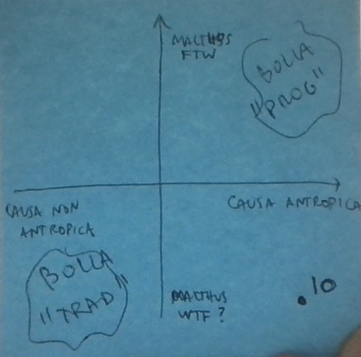

La **scienza** risponde a domande tipo "che cos'è un cambiamento climatico?", "sono in corso cambiamenti climatici?", "quali sono le cause di questi cambiamenti climatici?", eccetera. La **filosofia** risponde ad altre domande, del tipo "qual è il ruolo dell'uomo nel pianeta?". La **politica** determina che cosa fare, che politiche mettere in atto, ma anche in senso più ampio che comportamenti individuali cambiare o attuare.

Questi tre piani sono in costante comunicazione tra loro, ovviamente. Ad esempio, la filosofia suggerisce delle domande alla scienza: "scienziati, concentratevi sulle cause antropiche perchè l'uomo è un cancro del pianeta", oppure all'opposto "scienziati, concentratevi sulle cause naturali, perché altrimenti sembra che l'uomo sia un male per il pianeta!", oppure più sanamente "scienziati, che ruolo e che responsabilità abbiamo in questi cambiamenti climatici?". La scienza e la filosofia insieme informano le scelte politiche e pratiche (o almeno dovrebbero farlo). Eccetera.

I piani sono in comunicazione, ma non sono coincidenti: ad esempio uno potrebbe ritenere che i cambiamenti climatici abbiano una causa antropica, oppure no, e contemporaneamente sostenere una visione del monto neo malthusiana, oppure cattolica, e contemporaneamente ritenere corretto aderire agli accordi di Parigi, oppure no, e queste otto possibilità (2 x 2 x 2) sono tutte teoricamente concepibili.

Quello che succede però è che le persone si polarizzano in gran parte su DUE prospettive opposte, non omogeneamente su tutte e otto (o mille), e il motore trainante è quello culturale: hai una visione del mondo ambientalista / specista / anti umana, o anche solo semplicemente "moderna"? Probabilmente allora ritieni che i cambiamenti climatici siano causati dall'uomo e consideri Trump un cretino (anche) per essersi ritirato dagli accordi di Parigi. Sei cattolico con un minimo di dimestichezza nel magistero, dunque politicamente "conservatore" o "anti-modernista"? Beh, allora sicuramente non cadi nella balla neo malthusiana del cambiamento climatico e sostieni Trump nel tirarsi fuori dagli accordi di Parigi, vero?

> Sull'asse X un aspetto scientifico, a sinistra chi pensa che la causa dei cambiamenti climatici non sia antropica, a destra chi pensa sia antropica. Sull'asse Y un aspetto filosofico, in basso chi pensa che Malthusianesimo e compagnia bella siano da buttare, in alto chi pensa siano da valorizzare. In alto a destra c'è la bolla "progressista", in basso a sinistra la bolla "tradizionalista" (i termini sono estremamente imprecisi, chi vuole capire capisca e chi vuole offendersi si offenda). In basso a destra ci sono io.

Io sono convinto che i cambiamenti climatici abbiano una componente antropica e che siano/saranno un grosso problema per l'uomo, soprattutto per chi vive in situazioni già difficili. Una buona fonte di partenza è [il sito della NASA](https://climate.nasa.gov/evidence/), senza dubbio da integrare con altre. Trovo poco convincenti ipotesi alternative (nel senso che sono più convinto dalle loro confutazioni), che pure ho esplorato per quanto posso capirci.

Considero gli esseri umani come vertice della creazione e responsabili del creato. Il comportamento degli uomini nei confronti delle cose e degli animali dovrebbe essere improntato alla cura, all'attenzione, alla prospettiva di migliorare il mondo ed esplorare l'universo mantenendo la sua straordinaria ricchezza e diversità, e contemporaneamente rendendolo più ospitale per noi.

Infine, alla domanda "che cosa fare" sono in grossa difficoltà. Trovo molto valido l'ultimo libro di Bill Gates [How to Avoid a Climate Disaster](https://g.co/kgs/DQrXXt) perché dipinge un quadro e fornisce qualche framework per iniziare a ragionare, e seguo il dibattito sul nucleare (in particolare la pagina facebook [L'Avvocato dell'Atomo](https://www.facebook.com/AvvocatoAtomico)). Questo mi fa essere un minimo confidente nel dire che qualche proposta soluzione sicuramente non funziona ed è solo frutto di ideologia, ma per il momento non mi spingo molto più in là.

